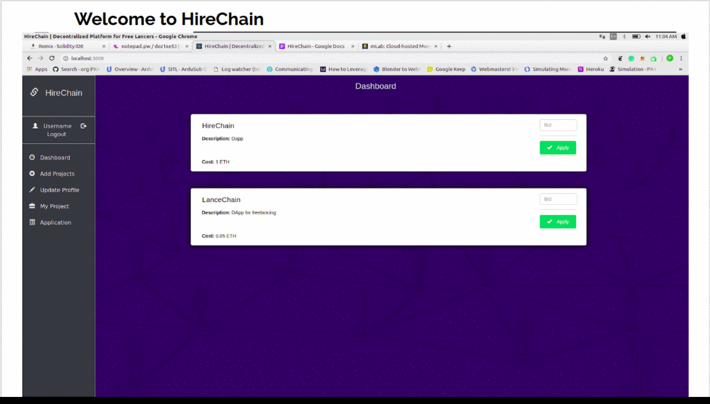

<p align="center">
  <a href="" rel="noopner">
    </a>

<h1 align="center">HireChain</h1>
<h4>An open platform for job openings and acceptance in various tech and non-tech fields. (Freelancing)</h4>

------------------------------------------
### Objectives

~`Fairness`: Direct employee to employer contact, no middleman.<br/>
~`Security`: Employer has to pay for the work done. Employee is also bind by the contract to complete work<br/>
~`Identity Protection`: No identity confirmation required.<br/>
~`Direct Payment`: Payment via ethereum wallet.<br/>
~`Limited T&C`: Social media and personal data sharing is banned.<br/>
~`Transparency`


------------------------------------------
### Features

-`Post project`:  Add your projects to the network so that other users can apply.<br/>
-`Apply for project`: You can apply for the available projects.<br/>
-`Bidding`: You can bid for the project and accordingly the project will be alloted.<br/>
-`Contract`: While acceptance of the project contract will be made between the employee and the employer.<br/>

------------------------------------------
### Demo

<p align="center">

</p>

------------------------------------------
### Installation
  * Step I: Clone the Repository
```sh
      $ git clone https://github.com/priyamshah112/HireChain.git      
```
  * Step II: Install server packages
```sh
      # On the terminal move into HireChain package directory
      $ cd HireChain
      $ npm install
```
* Step III: Install client packages
```sh
      # Open another terminal and move into Client package directory
      $ cd Client
      $ npm install
```
* Step IV: Run Server
```sh
      # Run server on the first terminal
      $ nodemon app
```

* Step V: Run Client
```sh
      # Run client on the second terminal
      $ npm start
```


