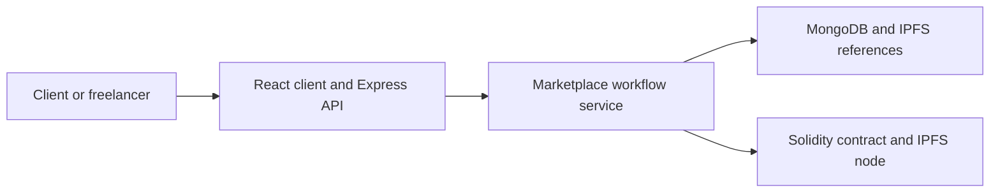
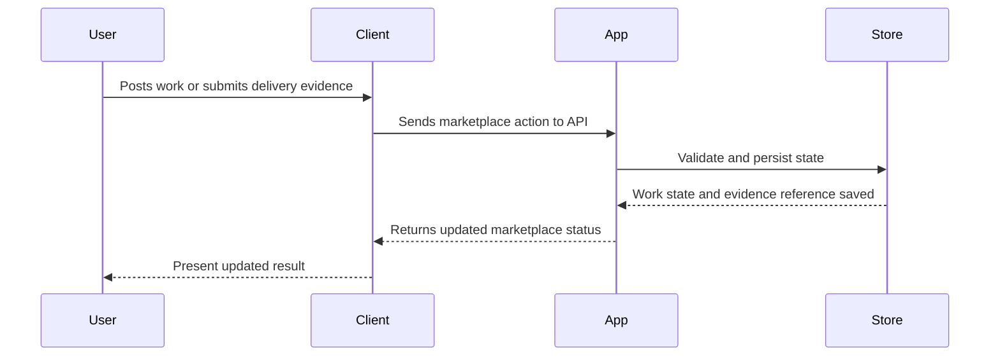

# Architecture

HireChain combines a conventional marketplace app with decentralized trust primitives. The web application handles workflow, MongoDB tracks application state, IPFS can hold delivery evidence, and a Solidity contract represents settlement logic.

## Component View

## Key Components

- Express API and route handlers
- MongoDB model layer
- React client application
- IPFS integration path
- HireChain Solidity contract

## Main Workflow

## Design Considerations

- Keep delivery evidence distinct from marketplace status
- Avoid making blockchain interactions invisible to users
- Design dispute and review flows before adding settlement automation

